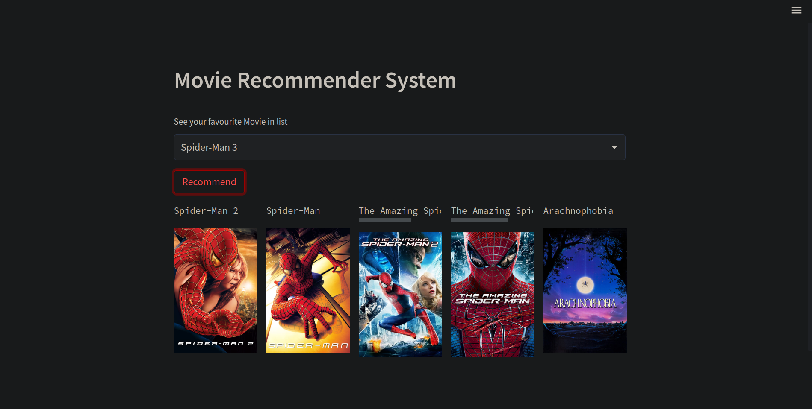

# Recommendation-system
## Recommender System 
<h3 align="center">
Hi there, I'm Aman</a> 👋
</h3>

<h2 align="center">
I'm a Data Science Aspirant 💻, ML Engineer 📸, and Designer 🎨!
</h2> 


## Recommender System
### Let's Recommand Movie and Anime
 ```
 If you don't know how a streamlit app runs go and read how to run this program.txt file.
 ```

 

 ## Here are my Recommender System Looks Like

 <!-- want to this data check the file  -->

for full code

[click here](https://drive.google.com/file/d/1rZ_pBwia1zVb5TriH2RChCj6Dy2ZmEnO/view?usp=drivesdk)


I love the entire process of developing ML Models. I love the challenge of finding caches and spending time to meet new people. Learning how people hide things and where people are likely to look.


- 💬 If you have any question/feedback, please do not hesitate to reach out to me!

## 🔭 I'm currently working on

- My old projects
- Open Source
- Looking For Internship Program


## 🌱 I'm currently learning

- 📱 Deep Learning
- ML Ops
- React Context API
- Open Source  

